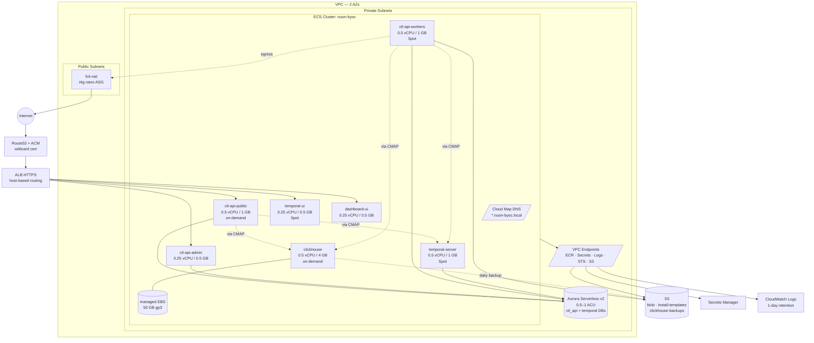

# `aws-ecs` Target Architecture (Fargate, ~$300/mo)

## Design principles
- **Single combined Aurora Serverless v2 Postgres** instead of two RDS instances — split via separate databases (`ctl_api`, `temporal`) on one cluster. Capacity-capped to bound cost.
- **Keep ClickHouse, run it as a Fargate task with an attached EBS volume** — avoids upstream ctl-api changes, keeps everything on the ECS deployment model (no EC2 to patch), gets gp3 performance. ~$30/mo.
- **Single ALB**, host-/path-based routing for api/auth/runner/slack/dashboard
- **No NAT gateway** — private Fargate tasks reach AWS APIs via **VPC Interface Endpoints** (ECR, Secrets Manager, CloudWatch Logs, STS) + S3 Gateway endpoint. Outbound internet (if needed for installs/runners) goes through a tiny `fck-nat` `t4g.nano` instance (~$5/mo).
- **Fargate Spot** for workers/temporal; on-demand only for the public API and ClickHouse (stateful, no Spot)
- **Right-size aggressively**: 0.25–0.5 vCPU tasks; scale-to-1 minimums

## Diagram

**Key flows**

1. **External traffic** → Route53 → ALB → ECS service target groups (`ctl-api-public`, `ctl-api-admin`, `dashboard-ui`, optionally `temporal-ui`)
2. **Intra-cluster** → Cloud Map DNS (`clickhouse.nuon-byoc.local:9000`, `temporal-server.nuon-byoc.local:7233`) — no ALB hop for service-to-service
3. **Egress** (e.g. runner installs) → private subnet → fck-nat in public subnet → internet
4. **AWS API access** → VPC endpoints (no NAT cost, no internet traversal)
5. **State**: Aurora ← Temporal + ctl-api; ClickHouse (managed EBS) ← ctl-api workers (heartbeats, OTel, policy events) + reads from public/admin; S3 ← blobs, install templates, CH nightly backups

**Single-AZ pin:** the ClickHouse task + its EBS volume live in one AZ. All other services span both AZs.

## Components

**Networking**
- VPC, 2 AZs (down from 3), 2 public + 2 private subnets
- 1 ALB (public), host-based routing
- VPC endpoints (interface): ECR API, ECR DKR, Secrets Manager, CloudWatch Logs, STS (~$7/mo each)
- VPC endpoint (gateway): S3 (free)
- Egress: `fck-nat` on a `t4g.nano` ASG (1 instance) instead of managed NAT

**Data**
- **Aurora Serverless v2 Postgres**: `min_capacity = 0.5 ACU`, `max_capacity = 1 ACU` — bounds cost at ~$44 idle / $88 ceiling. Hosts both `ctl_api` and `temporal` databases on one cluster.
  - Wire-compatible with stock Postgres; no SQL or app changes vs RDS.
  - Multi-AZ HA at the storage layer included; 10–30s failover.
  - Storage auto-grows ($0.10/GB-mo); I/O $0.20/M requests (small at this scale).
  - CloudWatch billing alarm at $290/mo as a backstop for runaway I/O.
- **ClickHouse on Fargate + EBS**: single-node CH in a Fargate task (0.5 vCPU / 4 GB), with a 50 GB gp3 EBS volume managed by ECS (`managedEBSVolume`). Volume persists across task restarts, re-attached in the same AZ. Single-AZ by design. Daily `clickhouse-backup` to S3.
  - Same env vars + driver as the EKS variant — **zero ctl-api code changes**.
  - Pure ECS ops model: image deploys via ECR + ECS service update; logs via awslogs; IAM via task role.
- **S3 buckets**: blob, install-templates, clickhouse-backups
- **Secrets Manager**: DB creds + ClickHouse password (~4 secrets)

**ClickHouse hosting decision (chosen path: Fargate + EBS)**

Four hosting options were evaluated. Two key drivers: keep ClickHouse storage on something that performs (ruling out EFS), and stay on the ECS deployment model where possible (avoiding a vanilla EC2 instance with a separate ops lifecycle).

| | Vanilla EC2 | ECS on EC2 | **Fargate + EBS (chosen)** | Fargate + EFS |
|---|---|---|---|---|
| Cost | $20 | $20 | ~$30 | ~$35+ |
| Performance | Excellent | Excellent | Excellent | **Poor — breaks under load** |
| ctl-api code changes | 0 | 0 | 0 | 0 |
| Server to patch | Yes (vanilla EC2) | Yes (ECS-optimized AMI) | No | No |
| Deploy model | systemd, apt | ECS push-image | ECS push-image | ECS push-image |
| Restart speed | ~10s (systemd) | ~30s (ECS pull+start) | ~60s (volume reattach) | ~30s |
| HA | Single AZ | Single AZ | Single AZ | Multi-AZ (but degraded perf) |
| Maturity | Decades | Years | ~2 years | Years (but wrong tool) |
| Unified ops with rest of stack | No | Yes | **Yes** | Yes |

**Why Fargate + EBS over the alternatives:**
- **EFS is disqualified on performance.** ClickHouse's mark-file access pattern is exactly what NFS is worst at; CH docs explicitly recommend against it.
- **Vanilla EC2** is cheapest but introduces a separate ops lifecycle (systemd, apt, AMI patching) inconsistent with the rest of the stack.
- **ECS on EC2** matches Fargate+EBS on cost ($20 vs $30) but still requires patching the ECS-optimized AMI and managing the ECS agent. The $10/mo premium on Fargate+EBS buys removal of all EC2 management.
- **Fargate + EBS** keeps everything pure-ECS: one deployment workflow, one IAM model, one log destination across ctl-api, temporal, dashboard, and ClickHouse.

**Trade-offs accepted with Fargate + EBS:**
- **Single-AZ.** EBS volumes are AZ-local; the ClickHouse task pins to one AZ. Lose that AZ, lose the task until you restore from S3 backup. Acceptable for sandbox-scale BYOC.
- **Slower restarts (~60s)** vs systemd's ~10s. Acceptable — CH doesn't restart often.
- **Fargate compute premium**: ~30–50% more expensive per vCPU/GB than EC2. Smallest viable CH task is 0.5 vCPU / 4 GB (~$25/mo). Built into the $30/mo line.
- **Newer feature.** Managed EBS volumes for Fargate shipped in early 2024 — less battle-tested than EBS-on-EC2; watch for edge cases around volume orphaning if a service is deleted incorrectly. Mitigation: lifecycle policy on the volume, KMS key separate from default.
- **Min sizing isn't tiny.** Can't go below 0.5 vCPU / 4 GB and still have CH function under realistic OTel load.

**ClickHouse data fit (kept here for context — see the EKS-vs-ECS analysis history):**

| Table | Pattern | S3+Athena fit | Long-term home |
|---|---|---|---|
| `runner_heart_beats` | Continuous streaming inserts, point reads | Bad — small-row writes + sub-second reads | ClickHouse |
| `runner_health_checks` | Periodic structured snapshots | Workable, but staleness hurts | ClickHouse |
| `latest_runner_heart_beats_mv_v3` | "Current state of every runner" dashboard | Bad — Athena 3–10s/query kills dashboard | ClickHouse MV |
| `policy_report_events` | Append-only, time-bucketed aggregations | Good — textbook S3+Athena | ClickHouse now, S3 Parquet later |
| `otel_*` (5 tables) | High-volume telemetry, time-range queries | Good — Athena was built for this | ClickHouse now, S3 Parquet later |

**Future migration path:** if/when telemetry volume saturates the single-node CH task, dual-write the cold-path tables (`policy_report_events`, `otel_*`) to S3 Parquet alongside ClickHouse, validate parity, switch analytics reads to Athena (or pre-aggregated rollups), then stop writing those tables to ClickHouse. Hot-path tables stay where they are.

**ECS Fargate cluster** (`nuon-byoc`)
| Service | Task size | Count | Notes |
|---|---|---|---|
| `ctl-api-public` | 0.5 vCPU / 1 GB | 1 (HPA 1–3) | On-demand, behind ALB |
| `ctl-api-admin` | 0.25 vCPU / 0.5 GB | 1 | Internal ALB listener rule |
| `ctl-api-workers` | 0.5 vCPU / 1 GB | 1 consolidated | Fargate Spot |
| `temporal-server` | 0.5 vCPU / 1 GB | 1 | Fargate Spot |
| `temporal-ui` | 0.25 vCPU / 0.5 GB | 1 | Optional |
| `dashboard-ui` | 0.25 vCPU / 0.5 GB | 1 | Static-ish frontend |
| `clickhouse` | 0.5 vCPU / 4 GB | 1 | **On-demand only** (stateful, no Spot); managed EBS 50 GB gp3 |

Total steady-state: ~**2.75 vCPU / 9 GB** across 7 tasks.

**Routing / DNS**
- 1 ALB w/ ACM wildcard cert
- Host rules: `api.*`, `auth.*`, `runner.*`, `slack.*`, `app.*`, `admin.*` → target groups
- Route53 public zone; intra-cluster via ECS Service Connect / Cloud Map (ClickHouse reachable as `clickhouse.nuon-byoc.local:9000`)

**Logs / observability**
- CloudWatch Logs with 1-day retention
- Container Insights off by default (~$2/task/mo)
- Optional Datadog stays opt-in

**IAM**
- ECS task roles per service (replaces IRSA): ctl-api → S3 + Secrets + ClickHouse SG; temporal → Secrets; dashboard → minimal; clickhouse → S3 backup bucket
- ECS managed-volume IAM permissions added to the execution role

## Estimated monthly cost

| Line item | Est $/mo |
|---|---|
| Fargate compute (~2.75 vCPU, ~9 GB, partial Spot) | **~$120** |
| Aurora Serverless v2 (0.5–1 ACU) + storage | **~$50** (idle) / **~$95** (ceiling) |
| ClickHouse Fargate (0.5 vCPU / 4 GB) + 50 GB gp3 EBS + backups | **~$30** |
| ALB (1 LCU avg) | **~$22** |
| VPC interface endpoints (4 × ~$7) | **~$28** |
| `fck-nat` t4g.nano + EBS | **~$5** |
| S3 + Secrets Manager + Route53 + ACM + KMS | **~$10** |
| CloudWatch Logs (1-day retention) | **~$10** |
| Data transfer (inter-AZ, egress) | **~$15** |
| **Total (typical)** | **~$290** |
| **Total (Aurora pegged at max ACU)** | **~$335** |

For comparison: current EKS-based `byoc-nuon` runs ~**$1,700–$2,250/mo** baseline. The ECS Fargate variant is roughly an **85% cost reduction** at steady state.

**Budget note:** the ClickHouse line moved $20 → $30 vs the vanilla-EC2 plan, taking the typical total from ~$255 to ~$290. The hard ceiling (Aurora pegged at 1 ACU) is now ~$335, which exceeds the $300 target. The ceiling is only reached under sustained DB load; in practice we expect typical cost. Mitigation if it materializes: drop Aurora `max_capacity` back to 0.75 ACU (cap at ~$66/mo), or downsize the ClickHouse task to 0.25 vCPU / 2 GB if telemetry volume is low.

## Trade-offs accepted
1. **ClickHouse is a single-AZ, single-task SPOF.** Daily S3 backup. Loss event: restore from yesterday's snapshot, lose ≤24h of telemetry.
2. **Fargate-EBS is a newer feature** — orphan-volume risk if a service is mis-deleted. Mitigate with retain-on-delete and KMS encryption.
3. **Cost ceiling now ~$335/mo** under Aurora-pegged worst case — over budget by $35. Acceptable since the ceiling is load-triggered, not steady-state.
4. **2 AZs**; Aurora gives multi-AZ storage HA, but compute is single-AZ-active.
5. **Worker consolidation** — losing per-namespace scaling; one bursty queue can starve others.
6. **Spot interruptions** for ctl-api workers / temporal — must be restart-safe (they are, by design). ClickHouse runs on-demand only.

## Alternative: Aurora-only (no ClickHouse)

If the cost ceiling becomes a real problem or the Fargate-EBS feature proves unreliable, the Aurora-only variant is documented as a fallback:
- Requires upstream ctl-api work (make ClickHouse optional + Postgres backend for the 5 tables), ~2–3 weeks
- Removes the ClickHouse task entirely (~$30/mo savings, ~$260 typical / ~$305 ceiling)
- Introduces Aurora I/O cost risk under OTel load — needs validation via load test
- Reversible: swap env vars back to a ClickHouse host if Postgres can't keep up
