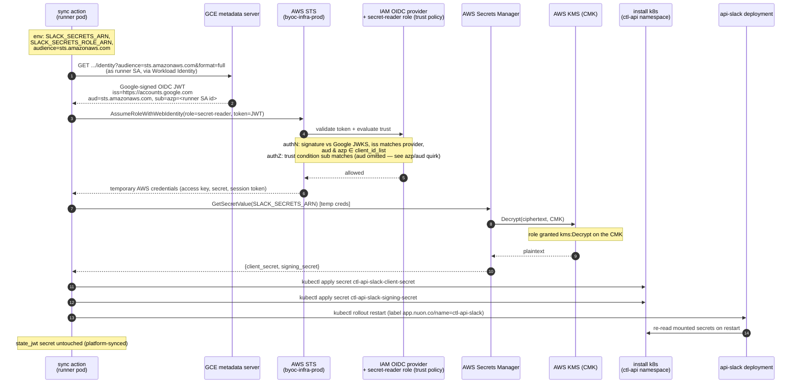

# AWS ↔ GCP identity federation

## What this is for

Central BYOC secrets (e.g. Slack credentials) live in a single **AWS Secrets
Manager** account, `byoc-infra-prod` — the same store for every install
regardless of which cloud the install runs in. An **AWS** install reads its
secret directly: its `<install_id>-maintenance` IAM role is named on the
secret's resource policy and the CMK key policy.

A **GCP** install has no AWS identity, so it can't be granted on an AWS
resource policy directly. Instead it **federates**: the install's runner proves
its Google identity to AWS and receives temporary AWS credentials scoped to read
only that install's secret. This document describes that federation path — why
it exists and exactly how a token becomes secret bytes.

The runtime side is the `sync_slack_secrets` action (`actions/slack/`); the AWS
side is provisioned by `mono/infra/byoc-secrets` (see its `gcp.tf`).

## The pieces

| Where | What | Purpose |
|---|---|---|
| Install (GCP) | Runner service account (`…-runner@<project>.iam.gserviceaccount.com`) | The identity the runner action actually runs as; mints Google OIDC tokens. |
| `byoc-infra-prod` (AWS) | IAM OIDC provider for `https://accounts.google.com` | Tells AWS to trust Google-signed tokens. Its `client_id_list` is the set of accepted `aud`/`azp` values. |
| `byoc-infra-prod` (AWS) | Per-install role `<install_id>-secret-reader` | What the runner assumes. Trust policy pins the install's runner-SA `sub`; identity policy grants read on that install's secret + the CMK. |
| `byoc-infra-prod` (AWS) | Secret + CMK | The secret value, encrypted with the shared customer-managed key. |

### Shared provider, per-install role

AWS allows only **one IAM OIDC provider per issuer URL per account**, so there
is exactly one `https://accounts.google.com` provider in `byoc-infra-prod`,
**shared by every GCP install**. Its `client_id_list` is the union of the
audience plus *every* GCP install's runner-SA id — the first GCP install
creates the provider, and each subsequent install appends its id to the list.

The `<install_id>-secret-reader` **role is per-install**, though: each one
references the shared provider but pins `accounts.google.com:sub` to its own
runner SA in its trust policy. So the shared provider only *authenticates* any
listed SA; a given role only *authorizes* its own install's SA — installs stay
isolated.

> If an `accounts.google.com` OIDC provider already exists in `byoc-infra-prod`
> (created outside this workspace), `terraform import` it once so this workspace
> manages its `client_id_list`, rather than letting the apply fail with
> `EntityAlreadyExists`.

## How it works

1. The action runs in the runner pod, whose effective GCP identity is the
   install's **runner service account** (via GKE Workload Identity).
2. It asks the GCE metadata server for an **OIDC identity token** with
   `audience=sts.amazonaws.com`. Google returns a signed JWT with
   `iss=https://accounts.google.com`, `aud=sts.amazonaws.com`, and
   `sub`/`azp` = the runner SA's numeric id.
3. The action calls `sts:AssumeRoleWithWebIdentity` against the per-install
   `…-secret-reader` role, presenting the token. No pre-existing AWS
   credentials are needed.
4. AWS validates the token and evaluates the role's trust policy, then returns
   temporary credentials.
5. The action reads the secret with those credentials; Secrets Manager
   transparently decrypts it via the CMK.
6. The action writes the values into the install's `ctl-api` namespace and rolls
   `api-slack`.

### Token validation: the two gates

AWS performs two distinct checks during `AssumeRoleWithWebIdentity`, and both
were sources of failure while building this out:

- **Authentication** — is the token valid and trusted? AWS verifies the
  signature against Google's JWKS, matches `iss` to the OIDC provider, and
  checks that **both** `aud` *and* `azp` are in the provider's
  `client_id_list`. Google SA tokens always carry `azp` (the SA's numeric id,
  per OIDC "authorized party"), so the list must contain the audience
  (`sts.amazonaws.com`) **and** every GCP install's runner-SA id. A missing id
  here surfaces as `InvalidIdentityToken: Incorrect token audience`.
- **Authorization** — may this identity assume this role? AWS evaluates the
  role's trust policy, which conditions on `accounts.google.com:sub` equalling
  the install's runner-SA id (see the `azp`/`aud` quirk below for why that's the
  *only* condition). A mismatch surfaces as `AccessDenied: Not authorized to
  perform sts:AssumeRoleWithWebIdentity`.

> We use an **explicit** IAM OIDC provider rather than AWS's built-in
> `accounts.google.com` web-identity principal. The built-in principal is for
> consumer "Sign in with Google" tokens whose audience is a real Google OAuth
> client ID; it does not accept the custom audience our runner mints.

### The `azp` / `aud` quirk (why the trust policy conditions on `sub` only)

You would expect the role's trust policy to also condition on
`accounts.google.com:aud == "sts.amazonaws.com"` — to require the token was
minted for AWS. **It must not, because that condition can never match.**

For the `accounts.google.com` issuer, AWS has special handling: **when the token
contains an `azp` (authorized party) claim, AWS populates the
`accounts.google.com:aud` *condition key* with the value of `azp`, not `aud`.**
Google service-account identity tokens *always* include `azp`, set to the SA's
numeric id. So at trust-evaluation time:

| Token claim | Value | What AWS exposes as the condition key |
|---|---|---|
| `aud` | `sts.amazonaws.com` | — (shadowed by azp) |
| `azp` | `<runner SA id>` | `accounts.google.com:aud` = `<runner SA id>` |
| `sub` | `<runner SA id>` | `accounts.google.com:sub` = `<runner SA id>` |

A trust condition `accounts.google.com:aud == "sts.amazonaws.com"` is therefore
compared against the SA id and is always **false** → `AccessDenied: Not
authorized to perform sts:AssumeRoleWithWebIdentity`, even though everything
looks correct. (Adding an `:aud == <SA id>` condition would work but is exactly
redundant with `:sub`.)

So we condition on `:sub` alone. The audience is **not** unenforced — it's
checked at *authentication* against the provider's `client_id_list` (which
contains `sts.amazonaws.com`); `:sub` then pins the exact SA for authorization.

This bites only the `accounts.google.com` issuer because of the azp-substitution
rule; it is the reason the `aud` condition is intentionally absent from
[`gcp.tf`](https://github.com/nuonco/mono/tree/main/infra/byoc-secrets/gcp.tf).

### Why the runner SA, not maintenance

The action mints its token from the metadata server's `default` service
account, which — under GKE Workload Identity — is the **runner** service
account (`runner_service_account_email` in the install stack outputs), not the
`…-maintenance` SA. The trust policy and the OIDC `client_id_list` must be
bound to the runner SA's numeric `uniqueId`. Get it by running the
`runner_sa_unique_id` action on the install, or by decoding a token the runner
mints.

## Sequence

## Onboarding a GCP install (summary)

1. Get the runner SA's numeric id — run the `runner_sa_unique_id` action.
2. In `mono/infra/byoc-secrets`, add the install to `var.gcp_installs` with that
   id, and apply. This creates/updates the OIDC provider's `client_id_list`, the
   `…-secret-reader` role, and the secret grants.
3. Set the install inputs `slack_secrets_arn` and `slack_secrets_role_arn` (from
   the workspace outputs `slack_secret_arns` / `slack_secret_role_arns`).
4. Run the `slack_setup` runbook.

See [`runbooks/slack_setup.md`](../runbooks/slack_setup.md) for the full
step-by-step.
