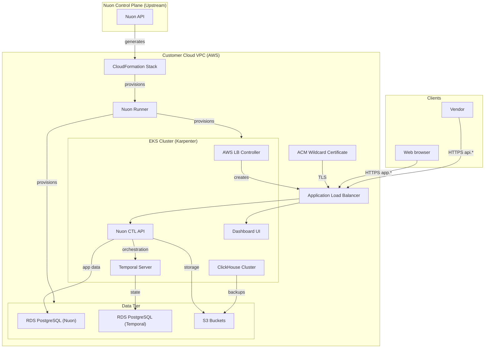

### What this app does?

Deploys the Nuon BYOC control plane into your AWS account — the platform that enables vendors to install and operate software in customer cloud VPCs. Includes the Nuon API, web dashboard, Temporal workflow engine, ClickHouse analytics, and supporting data infrastructure.

### Prerequisites

- A valid AWS account

### How to install/What to expect next?

- Clicking install will generate a link for you to log into AWS and create a CloudFormation stack which creates the VPC, EC2 VM, and a runner, an agent that receives jobs to deploy the Nuon control plane in your VPC
- If configured, you may be prompted to approve plan steps
- Average installation time is 60–90 minutes due to creating the VPC, EKS cluster, RDS databases, ClickHouse, Temporal, and all application services

### What gets deployed in your cloud account?

- Dedicated VPC
- AWS EKS Kubernetes cluster with Karpenter auto-scaling
- Two RDS PostgreSQL databases (Nuon control plane + Temporal)
- S3 buckets (application storage + ClickHouse backups)
- ClickHouse analytics cluster (server + keeper nodes)
- Temporal workflow engine (server + UI)
- Nuon CTL API and Dashboard UI
- Application load balancer
- ACM wildcard TLS certificate
- IAM roles for service accounts (IRSA)
- Optional Datadog observability integration

### What inputs can you enter?

**DNS**
- Root domain
- Nuon-managed DNS toggle

**Auth (OAuth / OIDC)**
- OAuth audience, client IDs, issuer URL
- OIDC provider type, client ID, redirect URL, allowed domains

**Infrastructure sizing**
- RDS instance types (Nuon DB, Temporal DB)
- ClickHouse instance types (cluster nodes, keeper nodes)

**Integrations (optional)**
- GitHub App credentials
- Datadog API/app keys
- Email service API key (Loops)

**Nuon**
- Environment (prod/dev)
- Custom runner image URL and tag

### Security & compliance

- [Nuon BYOC trust center](https://docs.nuon.co/guides/vendor-customers)
- All resource provisioning and scripts are performed by an agent in a VM in your VPC - no cross-account access granted to the vendor
- IRSA provides least-privilege IAM access scoped per service
- OIDC/OAuth authentication for API and dashboard access
- Wildcard TLS certificate secures all service endpoints
- RDS databases deployed in private subnets

### Nuon concepts

The following terminology is core to the Nuon BYOC platform.

#### Connect Your App | App Config
- App (collection of TOML config files that provision and manage the Nuon control plane in your cloud account)
- Sandbox (the underlying infrastructure, in this case an EKS Kubernetes cluster with Karpenter auto-scaling)
- Component (Docker images, Helm charts, and Terraform to deploy the CTL API, Dashboard, Temporal, ClickHouse, RDS, S3, IRSA, and TLS certificate)
- Inputs (dynamic values specific to the install e.g., root domain, auth credentials, instance types, integration keys)
- Secrets (sensitive values either auto-created or entered by the customer during Stack creation - stored in AWS Secrets Manager)

#### Support Customer Infrastructure | Customer Config

- Installs (Installs are instances of an application in your (the customer) cloud account.)
- Stack (the AWS CloudFormation stack that provisions the VPC, subnets, IAM roles, ASG, EC2 VM and Runner (agent) Docker service)
- Runners (Egress-only agents deployed in customer cloud accounts that execute all provisioning, deployment, and day-2 operations.)
- Operational Roles (IAM roles to perform different operations for least-privilege access across sandbox, components, and actions.)

#### Continuous Delivery | Day-2 Operations

- Workflows (Orchestration of the deployment, update & teardown lifecycle of apps, components, and actions)
- Policies (Rego & Kyverno configs to enforce compliance and security rules at infrastructure plan steps)
- Customer Portal (A customer-facing web dashboard to initiate and monitor an app's install in a customer's VPC)
